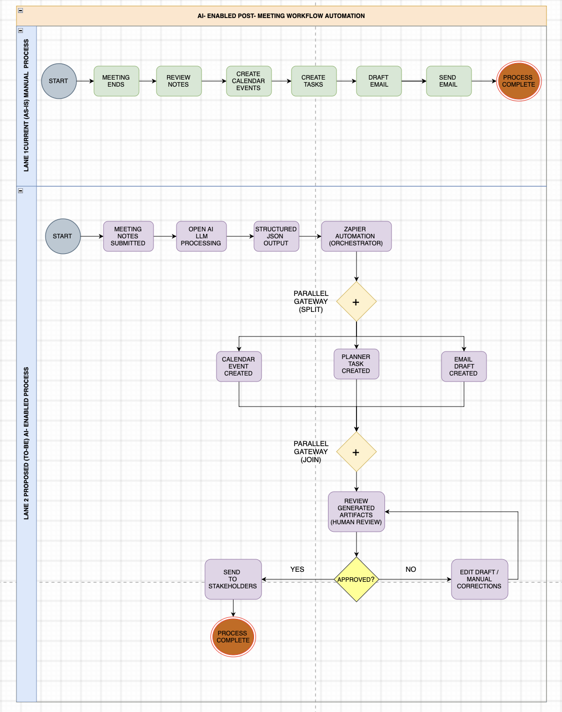

# AI-Powered Meeting Intelligence & Workflow Automation

> **Business Analysis + Generative AI + Workflow Automation**

An end-to-end workflow automation prototype that transforms unstructured meeting notes into structured business information and automates routine post-meeting activities using Generative AI and no-code automation.

---

## Executive Summary

### Project Overview

Post-meeting activities often involve reviewing notes, identifying action items, scheduling follow-ups, creating tasks, and preparing stakeholder communications across multiple applications.

This project demonstrates how Generative AI and workflow automation can redesign this process by converting unstructured meeting notes into structured business actions.

The solution uses **Zapier Forms** to capture meeting notes, **Google Gemini** to extract structured information, **JavaScript in Code by Zapier** to process the generated JSON, and **Zapier** to automate downstream business actions.

### Automated Outputs

The workflow produces:

- A Google Calendar follow-up event
- A Microsoft To Do action-item task
- A Gmail stakeholder email draft

The email is intentionally kept as a **draft for human review** before it is sent.

---

## Business Problem

Post-meeting administrative activities are often handled manually across multiple applications.

A typical process involves:

1. Reviewing meeting notes
2. Identifying action items and priorities
3. Creating calendar follow-ups
4. Creating task reminders
5. Drafting stakeholder communications
6. Reviewing and sending the communication

This creates repetitive administrative work and increases the risk of missed actions, inconsistent follow-ups, delayed communication, and manual data entry.

---

## Project Objectives

The project aims to:

- Automate routine post-meeting administrative activities
- Convert unstructured meeting notes into structured business information
- Generate follow-up calendar events automatically
- Create action-item tasks in Microsoft To Do
- Generate stakeholder email drafts in Gmail
- Retain human review before external communication is sent

---

## Proposed Solution

The workflow introduces an AI-enabled automation layer between meeting notes and downstream business applications.

**Meeting Notes → Zapier Forms → Google Gemini → Structured JSON → JavaScript Validation → Zapier Automation → Google Calendar / Microsoft To Do / Gmail Draft → Human Review**

The workflow separates AI-based information extraction from downstream business actions, allowing structured information to be reused across multiple applications.

---

## Solution Architecture

The implemented solution consists of the following components:

| Component | Purpose |
|---|---|
| Zapier Forms | Captures meeting notes and triggers the workflow |
| Google AI Studio (Gemini) | Analyses meeting notes and extracts structured information |
| Structured JSON | Standardises the AI-generated output |
| Code by Zapier | Parses and validates the generated JSON |
| Zapier | Orchestrates the downstream workflow |
| Google Calendar | Creates the follow-up calendar event |
| Microsoft To Do | Creates the action-item task |
| Gmail | Creates a stakeholder email draft |
| Human Review | Provides final review before communication |

### Architecture Diagram

 
https://github.com/mansiisingh836-bot/ai-meeting-workflow-automation/blob/main/solution-architecture.png%20.png

---

## Process Redesign

### Current State — As-Is

The original process relies heavily on manual administrative activities after a meeting.

**Meeting Ends → Review Notes → Update Calendar → Create Task → Draft Email → Send to Stakeholders**

### Future State — To-Be

The redesigned workflow automates information extraction and downstream task creation while retaining human review for stakeholder communication.

**Meeting Notes → AI Processing → Structured Data → Automated Business Actions → Human Review → Communication**

### As-Is vs To-Be Process



---

## Workflow Implementation

### Step 1 — Meeting Notes Submission

The user submits meeting information through **Zapier Forms**.

The form acts as the entry point for the workflow and provides the meeting notes that will be processed by the AI layer.

### Step 2 — AI Processing

Google Gemini analyses the submitted meeting notes and extracts structured information, including:

- Meeting title
- Meeting date
- Meeting time
- Duration
- Action item
- Priority
- Email draft

### Step 3 — Structured Data Processing

Gemini returns the extracted information in JSON format.

**Code by Zapier** uses JavaScript to:

- Parse the AI response
- Validate the JSON structure
- Extract the required fields
- Prepare the information for downstream automation

### Step 4 — Calendar Automation

The structured meeting information is used to create a Google Calendar event.

The workflow maps the relevant meeting information, including:

- Meeting title
- Meeting date
- Meeting time
- Duration

into the calendar event.

### Step 5 — Task Automation

The identified action item is used to create a Microsoft To Do task.

The extracted priority can also be used to support task prioritisation.

### Step 6 — Email Draft Generation

The generated stakeholder communication is passed to Gmail as an email draft.

The email is **not automatically sent**.

Instead, it remains in Gmail Drafts until a human reviews and sends it.

---

## Testing & Validation

The workflow was validated using defined **User Acceptance Testing (UAT)** scenarios.

Five test cases were completed successfully:

| Test Case | Description | Expected Result | Actual Result | Status |
|---|---|---|---|---|
| UAT-01 | Meeting Notes Parsing | Structured JSON generated | Structured JSON successfully generated with required meeting and action-item fields | PASS |
| UAT-02 | Calendar Event Creation | Calendar event created correctly | Google Calendar event successfully created with the required date, time and duration | PASS |
| UAT-03 | Task Creation | Action item created | Microsoft To Do task successfully created | PASS |
| UAT-04 | Email Draft Creation | Stakeholder email draft generated | Gmail draft successfully created for human review | PASS |
| UAT-05 | End-to-End Workflow | Complete workflow executes successfully | Zap test completed successfully | PASS |

## Zap Run Evidence

The workflow was successfully executed through Zapier, with the Zap Run confirming the processing of the meeting input and execution of the downstream automation steps.

https://zapier.com/app/history/01b0451c-19f9-ac54-8136-5e879386c2d4?root_id=375663432#0=input

[View detailed UAT test cases](documentation/uat-test-cases.md)

---

## Business Analysis Artifacts

The project was developed using Business Analysis practices across requirements definition, process analysis, solution design, and testing.

### Requirements Documentation

- [Business Requirements](documentation/business-requirements.md)
- [Functional Requirements](documentation/functional-requirements.md)
- [UAT Test Cases](documentation/uat-test-cases.md)

### Process & Architecture

- [As-Is / To-Be Process](as-is-to-be-process.png)
- [Solution Architecture](solution-architecture.png) 

---

## Key Business Outcomes

The project demonstrates the potential to:

- Reduce repetitive post-meeting administrative work
- Standardise meeting information into structured data
- Automate follow-up task creation
- Automate calendar event creation
- Accelerate stakeholder communication preparation
- Improve consistency across post-meeting workflows
- Maintain human oversight for external communication

> **Note:** These are potential business outcomes demonstrated by the prototype. No production-level time or cost savings are claimed because the workflow has not been deployed at organisational scale.

---

## Technology Stack

### Generative AI

- Google AI Studio
- Gemini

### Workflow Automation

- Zapier
- Zapier Forms
- Code by Zapier

### Business Applications

- Google Calendar
- Microsoft To Do
- Gmail

### Data Processing

- JSON
- JavaScript

### Business Analysis

- Requirements elicitation
- Functional requirements
- As-Is / To-Be process mapping
- Workflow analysis
- UAT
- Stakeholder communication

---

## Human-in-the-Loop Design

The solution intentionally does not automatically send stakeholder emails.

The final communication follows a controlled workflow:

**AI Generates → Gmail Creates Draft → Human Reviews → Human Edits if Required → Human Sends**

This provides a human control point for validating AI-generated communication before it reaches external stakeholders.

The approach demonstrates how AI automation can be combined with human oversight rather than fully automating a potentially sensitive communication step.

---

## Current Limitations

This project is a portfolio-scale prototype and has not been deployed as an enterprise production system.

Current limitations include:

- Workflow depends on the configured third-party applications
- Email communication remains human-reviewed
- No enterprise database or persistent application backend is implemented
- Performance has not been measured at production scale
- The workflow depends on the quality and completeness of the submitted meeting notes

---

## Future Enhancements

Potential future improvements include:

- Integration with meeting transcripts
- Integration with Microsoft Outlook Calendar for enterprise environments
- Slack or Microsoft Teams notifications
- Jira or Asana task integration
- Enterprise database storage
- Error handling and retry mechanisms
- Audit logging
- Advanced workflow analytics
- Automated stakeholder routing
- Role-based access controls
- Production-scale monitoring

---

## Business Analysis Perspective

This project demonstrates the ability to move from **business problem identification to requirements definition, process redesign, solution implementation, and UAT validation**.

The project follows a structured Business Analysis approach:

**Business Problem → Requirements Definition → Process Analysis → Process Redesign → AI Solution Design → Workflow Automation → Data Structuring → UAT Validation → Human-in-the-Loop Controls**

### Key Capabilities Demonstrated

**Requirements → Process Mapping → AI Solution Design → Workflow Automation → Data Structuring → UAT → Human-in-the-Loop Controls**

---

## Repository Structure

```text
ai-meeting-workflow-automation/
│
├── documentation/
│   ├── business-requirements.md
│   ├── functional-requirements.md
│   └── uat-test-cases.md
│
├── screenshots/
│   ├── 01-zapier-workflow.png
│   ├── 02-gemini-json-output.png
│   ├── 03-calendar-todo-verification.png
│   └── 04-gmail-draft-review.png
│
├── as-is-to-be-process.png
├── solution-architecture.png
└── README.md
```

---

## Contact

**Mansi Singh**

Business & Operations Analyst

Mumbai, India

[LinkedIn](https://www.linkedin.com/in/mansisingh836/)
